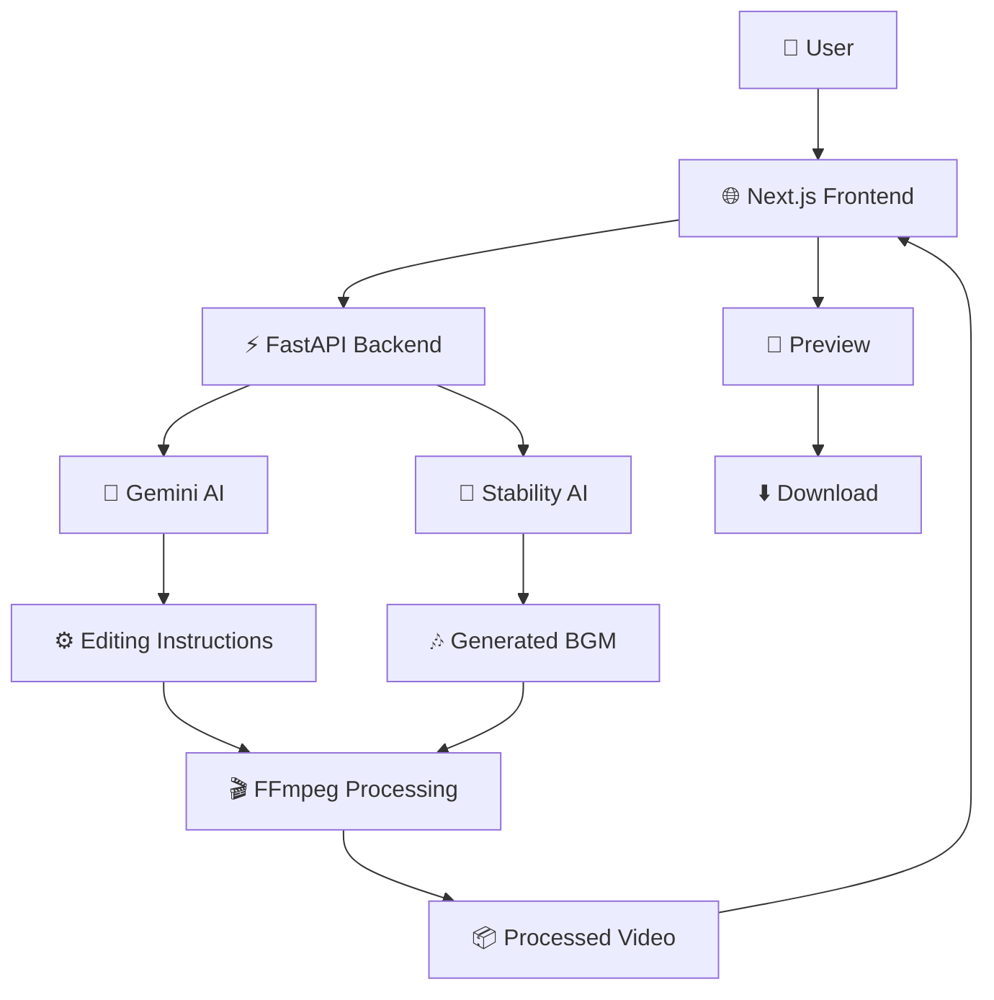

<div align="center">

# 🤖 AatoZen.AI

### Where AI Meets Effortless Editing

**AI-Orchestrated Video Editing & Background Music Generation**

<p>
  
  
  
  
  
</p>

<p>
  
  
  
</p>

<br>


</div>

---

# ✨ What is AatoZen.AI?

> **Turn your creative intent into a finished video with AI.**

**AatoZen.AI** is a production-oriented AI video editing platform that combines **Generative AI, automated video processing, FFmpeg orchestration, and AI-generated background music** into a single workflow.

Instead of manually figuring out complex video-processing commands, users can describe what they want and let AI orchestrate the underlying editing pipeline.

```text
                    💬 USER INTENT
                         │
                         ▼
                 🧠 AI ORCHESTRATOR
                         │
                         ▼
                ⚙️ EDITING INSTRUCTIONS
                         │
                         ▼
                    🎬 FFmpeg
                         │
                         ▼
                  🎥 PROCESSED VIDEO
```

AatoZen.AI is designed around one simple idea:

# **Create more. Edit less.**

---

# 🚀 Core Experience

```text
       ┌──────────────────────────────────────┐
       │             AatoZen.AI               │
       │                                      │
       │       🧠 AI-Powered Editing          │
       │                                      │
       └──────────────────┬───────────────────┘
                          │
          ┌───────────────┼───────────────┐
          │               │               │
          ▼               ▼               ▼
      🎬 VIDEO         🎵 MUSIC        🧠 AI
      EDITING          GENERATION      ORCHESTRATION
          │               │               │
          └───────────────┼───────────────┘
                          │
                          ▼
                   ✨ FINAL CONTENT
```

---

# ⚡ How It Works

### Simple 4-Step Workflow

```text
┌──────────────┐
│  01          │
│  📤 UPLOAD   │
│              │
│ Upload video │
└──────┬───────┘
       │
       ▼
┌──────────────┐
│  02          │
│  🧠 AI       │
│  ORCHESTRATE │
│              │
│ Understand   │
│ the request  │
└──────┬───────┘
       │
       ▼
┌──────────────┐
│  03          │
│  ⚙️ PROCESS  │
│              │
│ AI-generated │
│ FFmpeg flow  │
└──────┬───────┘
       │
       ▼
┌──────────────┐
│  04          │
│  🎬 OUTPUT   │
│              │
│ Preview &    │
│ Download     │
└──────────────┘
```

---

# 🧠 AI Video Orchestration

The core of AatoZen.AI is an AI-driven orchestration layer.

Instead of exposing users directly to complex FFmpeg syntax:

```bash
ffmpeg -i input.mp4 ...
```

the platform allows AI to interpret the desired editing operation and generate the corresponding processing workflow.

```text
User Request
     │
     ▼
┌───────────────┐
│    Gemini     │
│ AI Reasoning  │
└───────┬───────┘
        │
        ▼
 Editing Intent
        │
        ▼
 FFmpeg Command
        │
        ▼
 Video Processing
        │
        ▼
 Final Output
```

### Example

```text
User:

"Trim the video, add background music
and export the final version."

                 ↓

              Gemini

                 ↓

        Editing Instructions

                 ↓

             FFmpeg

                 ↓

        🎬 Final Video
```

---

# 🎵 AI Background Music Generation

AatoZen.AI also integrates AI-generated background music into the creative workflow.

```text
        🎬 VIDEO
           │
           ▼
    ┌───────────────┐
    │ Creative Intent│
    └───────┬───────┘
            │
            ▼
       🎵 AI MUSIC
            │
            ▼
      Music Generation
            │
            ▼
       Audio Processing
            │
            ▼
      🎬 Video + BGM
```

The system is designed to make background music generation part of the same editing experience rather than requiring separate tools.

---

# 🎨 Premium User Interface

AatoZen.AI uses a modern visual experience built around:

### ✨ Glassmorphism

```text
┌────────────────────────────────────────┐
│                                        │
│        🧠 AatoZen.AI                  │
│                                        │
│     ┌────────────────────────────┐     │
│     │                            │     │
│     │   Upload your video 🎥     │     │
│     │                            │     │
│     └────────────────────────────┘     │
│                                        │
└────────────────────────────────────────┘
```

### 🌌 Animated AI Molecule Background

The interface includes an animated AI-inspired background to create a more immersive product experience.

```text
        ●──────●
       /        \
      ●          ●
       \        /
        ●──────●
            \
             ●
```

The frontend combines animated visual elements with a glass-style interface to create a modern AI-product feel.

---

# 🏗️ Architecture



---

# 🧩 Complete System Flow

```text
                         👤 USER
                           │
                           ▼
                 ┌───────────────────┐
                 │   🌐 NEXT.JS      │
                 │    FRONTEND       │
                 └─────────┬─────────┘
                           │
                           ▼
                 ┌───────────────────┐
                 │   ⚡ FASTAPI      │
                 │     BACKEND       │
                 └─────────┬─────────┘
                           │
              ┌────────────┴────────────┐
              │                         │
              ▼                         ▼
       ┌──────────────┐          ┌──────────────┐
       │ 🧠 GEMINI    │          │ 🎵 STABILITY │
       │ AI           │          │ AI           │
       └──────┬───────┘          └──────┬───────┘
              │                         │
              ▼                         ▼
       Editing Logic                BGM
              │                         │
              └────────────┬────────────┘
                           │
                           ▼
                    ┌─────────────┐
                    │  🎬 FFmpeg  │
                    └──────┬──────┘
                           │
                           ▼
                    📦 OUTPUT VIDEO
                           │
                           ▼
                    🎥 PREVIEW
                           │
                           ▼
                     ⬇️ DOWNLOAD
```

---

# 🛠️ Technology Stack

## 🎨 Frontend

<p>

</p>

* Next.js
* TypeScript
* Tailwind CSS
* Modern component architecture
* Animated UI
* Glassmorphism interface

---

## ⚡ Backend

<p>

</p>

* Python
* FastAPI
* REST APIs
* Service-oriented architecture
* Media processing services

---

## 🧠 Artificial Intelligence

```text
┌───────────────────────────────────────┐
│              AI LAYER                 │
├───────────────────────────────────────┤
│                                       │
│       🧠 Google Gemini                │
│       🎵 Stability AI                 │
│                                       │
│       AI Orchestration                │
│       Music Generation                │
│                                       │
└───────────────────────────────────────┘
```

---

## 🎬 Media Processing

* FFmpeg
* Video processing
* Audio processing
* Metadata handling
* Automated rendering

---

# 📁 Project Structure

```text
AatoZen.AI/
│
├── 📁 backend/
│   │
│   ├── 📁 app/
│   │   ├── 📄 main.py
│   │   │
│   │   ├── 📁 core/
│   │   │   ├── config
│   │   │   └── security
│   │   │
│   │   ├── 📁 services/
│   │   │   ├── video
│   │   │   ├── music
│   │   │   └── AI orchestration
│   │   │
│   │   └── 📁 utils/
│   │       ├── FFmpeg
│   │       └── metadata
│   │
│   ├── 📁 uploads/
│   ├── 📁 outputs/
│   ├── 📄 requirements.txt
│   └── 🐳 Dockerfile
│
├── 📁 frontend/
│   │
│   ├── 📁 src/
│   │   ├── 📁 app/
│   │   ├── 📁 components/
│   │   └── 📁 lib/
│   │
│   ├── 📁 public/
│   ├── 📄 package.json
│   ├── 📄 next.config.js
│   └── 📄 tailwind.config.ts
│
├── 📄 DEPLOYMENT.md
└── 📄 README.md
```

---

# 🔥 Features

| Capability                  | Status |
| --------------------------- | :----: |
| 📤 Video Upload             |    ✅   |
| 🧠 AI Video Orchestration   |    ✅   |
| 🤖 Gemini Integration       |    ✅   |
| 🎬 FFmpeg Processing        |    ✅   |
| 🎵 AI Background Music      |    ✅   |
| 🤖 Stability AI Integration |    ✅   |
| 🎥 Video Preview            |    ✅   |
| ⬇️ Video Download           |    ✅   |
| 🌌 Animated AI Background   |    ✅   |
| 💎 Glassmorphism UI         |    ✅   |
| ⚡ FastAPI Backend           |    ✅   |
| ⚛️ Next.js Frontend         |    ✅   |
| 🐳 Docker Backend           |    ✅   |
| ☁️ Deployment Workflow      |   🚧   |

---

# 🔐 Environment Variables

Create a `.env` file inside the backend directory.

```env
GEMINI_API_KEY=your_gemini_api_key
STABILITY_API_KEY=your_stability_api_key
```

> 🔒 Never commit API keys or secrets to GitHub.

Add sensitive environment files to `.gitignore`:

```gitignore
.env
.env.local
__pycache__/
node_modules/
uploads/
outputs/
```

---

# 💻 Local Development

## 1️⃣ Clone the Repository

```bash
git clone https://github.com/chandramouli9392/AatoZen.AI-Phase--1.git

cd AatoZen.AI-Phase--1
```

---

## 2️⃣ Start Backend

```bash
cd backend

pip install -r requirements.txt

uvicorn app.main:app --reload
```

Backend:

```text
http://localhost:8000
```

---

## 3️⃣ Start Frontend

Open another terminal:

```bash
cd frontend

npm install

npm run dev
```

Frontend:

```text
http://localhost:3000
```

---

# 🔄 Development Workflow

```text
             Developer
                 │
                 ▼
        ┌─────────────────┐
        │   Next.js UI    │
        └────────┬────────┘
                 │
                 ▼
        ┌─────────────────┐
        │ FastAPI Backend │
        └────────┬────────┘
                 │
       ┌─────────┴─────────┐
       ▼                   ▼
   🧠 Gemini          🎵 Stability
       │                   │
       └─────────┬─────────┘
                 ▼
              FFmpeg
                 │
                 ▼
             🎬 Output
```

---

# ☁️ Deployment

AatoZen.AI is structured for separate frontend and backend deployment.

```text
                    ☁️ CLOUD
                       │
          ┌────────────┴────────────┐
          │                         │
          ▼                         ▼
      ▲ VERCEL                  🚀 RENDER
          │                         │
          ▼                         ▼
     Next.js App              FastAPI API
                                    │
                                    ▼
                                  FFmpeg
```

### Frontend

**Vercel**

Designed for deploying the Next.js application.

### Backend

**Render**

Designed for deploying the FastAPI service and backend processing workflow.

For the complete deployment process, see the project's deployment guide:

[Deployment Guide](https://github.com/chandramouli9392/AatoZen.AI-Phase--1/blob/main/DEPLOYMENT.md?utm_source=chatgpt.com)

---

# 🧠 Product Philosophy

Traditional editing:

```text
Upload
  ↓
Find a Tool
  ↓
Configure Parameters
  ↓
Write Commands
  ↓
Process
  ↓
Preview
  ↓
Modify
  ↓
Repeat
```

AatoZen.AI:

```text
       💬 Tell AI what you want
                  ↓
           🧠 AI understands
                  ↓
        ⚙️ AI creates workflow
                  ↓
             🎬 FFmpeg
                  ↓
            🎥 Preview
                  ↓
             ⬇️ Export
```

The objective is to make complex media processing feel more accessible through AI-driven orchestration.

---

# 🔮 Future Roadmap

### 🎬 Intelligent Editing

* [ ] AI scene detection
* [ ] Automatic cuts
* [ ] Smart trimming
* [ ] Silence removal
* [ ] Highlight generation

### 🎵 Audio Intelligence

* [ ] Automatic BGM matching
* [ ] Beat synchronization
* [ ] Audio normalization
* [ ] Voice enhancement
* [ ] Intelligent sound mixing

### 🧠 AI Capabilities

* [ ] Natural-language editing
* [ ] Multi-step AI workflows
* [ ] AI editing agents
* [ ] Context-aware editing
* [ ] Automated creative suggestions

### ☁️ Infrastructure

* [ ] GPU processing
* [ ] Cloud rendering
* [ ] Queue-based processing
* [ ] Scalable workers
* [ ] Object storage
* [ ] Job monitoring

---

# 🌟 The Bigger Vision

AatoZen.AI is moving toward a world where video editing becomes a **conversation instead of a complicated workflow**.

Imagine saying:

```text
"Make this video more cinematic.

Remove the silent portions,
add suitable background music,
improve the audio,
and create a short version
for social media."
```

Instead of manually configuring dozens of editing tools:

```text
                    💬
              Natural Language
                     │
                     ▼
              🧠 AI EDITOR
                     │
          ┌──────────┼──────────┐
          ▼          ▼          ▼
       ✂️ EDIT     🎵 MUSIC    🔊 AUDIO
          │          │          │
          └──────────┼──────────┘
                     ▼
                  FFmpeg
                     │
                     ▼
               🎬 FINAL VIDEO
```

That is the direction of **AatoZen.AI**.

---

# 📊 Project Status

<div align="center">

### 🟢 ACTIVE DEVELOPMENT

New AI capabilities, editing workflows, UI improvements, and media-processing features are continuously being integrated.

</div>

---

# 👨‍💻 Author

<div align="center">

# Chandramouli Boppana

### AI Engineer • Generative AI Builder • Computer Vision Enthusiast

Building AI-powered systems that transform complex workflows into simple experiences.

<br>

<a href="https://github.com/chandramouli9392">

</a>

</div>

---

# ⭐ Support the Project

If you find **AatoZen.AI** interesting:

⭐ Star the repository

🍴 Fork the project

🐛 Report bugs

💡 Suggest features

🤝 Contribute

---

<div align="center">

## 🤖 AatoZen.AI

### Where AI Meets Effortless Editing

**Upload → Orchestrate → Create → Export**

<br>


</div>
